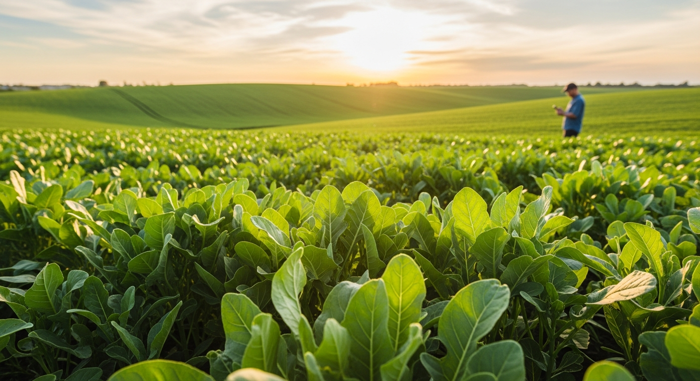

# AgriSenseFlow 🌱



**AgriSenseFlow** is a cutting-edge, AI-powered agricultural assistant designed to help farmers detect crop diseases instantly using their smartphones. By combining advanced computer vision with real-time environmental data, we provide actionable insights to protect crops and optimize yields.

🚀 **Live Demo**: [https://agri-sense-flow.vercel.app/](https://agri-sense-flow.vercel.app/)

---

## 🧠 Novel Training Pipeline

Our object detection model is built using a unique **Weakly Supervised Learning** approach to overcome the scarcity of labeled bounding box datasets in agriculture.

### The Challenge
Standard object detection datasets (like PlantDoc) are small and often have noisy labels. Large classification datasets (like PlantVillage) exist but lack bounding box annotations.

### Our Solution: Two-Stage Transfer Learning
We implemented a custom training pipeline (see `Data_making.py`) that bridges this gap:

1.  **Binary Classification & Grad-CAM**:
    *   We first trained a **ResNet18** classifier on the **PlantVillage** dataset (Healthy vs. Diseased).
    *   Using **Grad-CAM (Gradient-weighted Class Activation Mapping)**, we generated heatmaps to visualize *where* the model was looking to detect diseases.

2.  **Pseudo-Label Generation**:
    *   These heatmaps were thresholded and processed using OpenCV to generate **pseudo-bounding boxes** automatically.
    *   This effectively converted the classification dataset into a massive, weakly-labeled object detection dataset.

3.  **Stage 1: Knowledge Distillation (Pre-training)**:
    *   We pre-trained a **YOLOv8** model on this large, pseudo-labeled dataset. This taught the model the general visual features of crop diseases.

4.  **Stage 2: Fine-Tuning**:
    *   Finally, we fine-tuned the model on the smaller, real-world **PlantDoc** dataset.
    *   This refined the model's ability to detect diseases in complex, real-field backgrounds.

### Datasets Used
*   **PlantVillage** (Classification): [Kaggle Link](https://www.kaggle.com/datasets/abdallahalidev/plantvillage-dataset)
*   **PlantDoc** (Object Detection): [Kaggle Link](https://www.kaggle.com/datasets/andresmgs/plantdec)

### 🏆 Model Output
The final trained model is available here:
[**Download Model Weights**](https://kaggle.com/datasets/f788ae4e3b8a23df39a6a43e50060e57e120a478c83964d0cc14bcdc7729a95d)

---

## ✨ Features


### ✅ Currently Working
*   **📸 Instant Disease Detection**: Upload or take a photo of a crop leaf to detect diseases with high accuracy using our custom YOLOv8 model.
*   **🤖 AI AgriBot**: A specialized chatbot powered by **Llama-3** (via Groq) that provides detailed treatment advice, organic remedies, and farming tips based on detection results.
*   **weather Weather Insights**: Real-time weather updates and forecasts for your specific location using OpenWeatherMap.
*   **🌱 Soil Analysis**: Location-based soil composition data (pH, nitrogen, organic carbon, etc.) using ISRIC SoilGrids.
*   **📊 Analytics Dashboard**: Track detection history, view disease distribution maps, and analyze trends over time.
*   **🌍 Multi-language Support**: Interface available in English, Hindi, Gujarati, Marathi, Tamil, and Telugu.

### 🔮 Coming Soon
*   **🗣️ Real-time Translation**: Voice-to-voice translation for advisory services (Integration with Bhashini API is in progress).
*   **📱 Offline Mode**: On-device inference for remote areas with poor connectivity.

---

## 🛠️ Tech Stack

*   **Frontend**: React, Vite, TailwindCSS, Shadcn UI
*   **Backend**: Node.js, Express
*   **AI/ML**: PyTorch, YOLOv8, FastAI, OpenCV
*   **LLM**: Llama-3-70b (via Groq)
*   **APIs**: OpenWeatherMap, ISRIC SoilGrids, Bhashini (Upcoming)
*   **Deployment**: Vercel

---

## 🚀 Getting Started

1.  **Clone the repository**
    ```bash
    git clone https://github.com/roshanrateria/AgriSenseFlow.git
    cd AgriSenseFlow
    ```

2.  **Install Dependencies**
    ```bash
    npm install
    ```

3.  **Set up Environment Variables**
    Create a `.env` file with the following keys:
    ```env
    GROQ_API_KEY=your_key
    OPENWEATHER_API_KEY=your_key
    HUGGINGFACE_ENDPOINT=your_endpoint
    BHASHINI_ULCA_KEY=your_key
    BHASHINI_USER_ID=your_id
    ```

4.  **Run Development Server**
    ```bash
    npm run dev
    ```

---